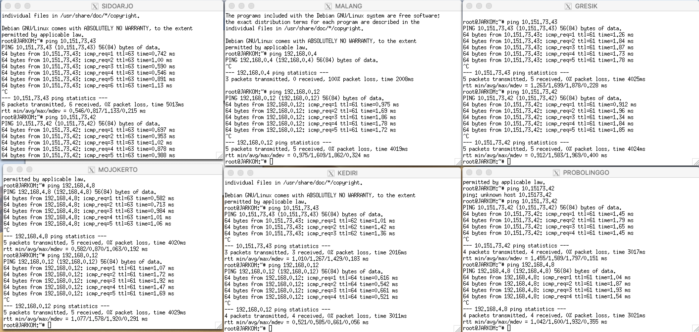

# Jarkom_Modul5_Lapres_A04

**(A).** Tugas pertama kalian yaitu membuat topologi jaringan sesuai dengan rancangan yang diberikan Bibah seperti dibawah ini :


topologi.sh


**(B).** Karena kalian telah mempelajari Subnetting dan Routing, Bibah meminta kalian untuk membuat topologi tersebut menggunakan teknik ​CIDR atau ​VLSM​.

**(C).** Kalian juga diharuskan melakukan routing agar setiap perangkat pada jaringan tersebut dapat terhubung.




**(D).** Tugas berikutnya adalah memberikan ip pada subnet ​SIDOARJO dan ​GRESIK secara dinamis menggunakan bantuan DHCP SERVER (Selain subnet tersebut menggunakan ip static). Kemudian kalian mengingat bahwa kalian harus setting DHCP RELAY pada router yang menghubungkannya, seperti yang kalian telah pelajari di masa lalu.

Konfigurasi DHCP Server


Konfigurasi DHCP Relay
    
    

**1.** Agar topologi yang kalian buat dapat mengakses keluar, kalian diminta untuk mengkonfigurasi SURABAYA ​menggunakan iptables, namun Bibah tidak ingin kalian menggunakan MASQUERADE.

Konfigurasi Iptables
```
    iptables -t nat -A POSTROUTING -s 192.168.0.0/16 -o eth0 -j SNAT --to-source 10.151.72.20
```


**2.** Kalian diminta untuk mendrop semua akses SSH dari luar Topologi (UML) Kalian pada server yang memiliki ip DMZ (DHCP dan DNS SERVER) pada ​SURABAYA​ demi menjaga keamanan.

Konfigurasi iptables
```
    iptables -N LOGGING // create a new chain called LOGGING
    iptables -A FORWARD -p tcp --dport 22 -d 10.151.73.40/29 -i eth0 -j LOGGING
    iptables -A LOGGING -m limit --limit 2/min -j LOG --log-prefix "DROP: " --log-level info
    // log the incoming packets to syslog
    iptables -A LOGGING -j DROP
```


DROPPED


**3.** Karena tim kalian maksimal terdiri dari 3 orang, Bibah meminta kalian untuk membatasi DHCP dan DNS server hanya boleh menerima maksimal 3 koneksi ICMP secara bersamaan yang berasal dari mana saja menggunakan ​iptables pada masing masing server​, selebihnya akan di DROP.

Konfigurasi iptables
```
iptables -N LOGGING
iptables -A INPUT -p icmp -m connlimit --connlimit-above 3 --connlimit-mask 0 -j LOGGING
iptables -A LOGGING -m limit  --limit 2/min -j LOG --log-prefix "DROP: " --log-level info
iptables -A LOGGING -j DROP

```

MOJOKERTO


MALANG


Kemudian kalian diminta untuk membatasi akses ke MALANG yang berasal dari SUBNET SIDOARJO dan SUBNET GRESIK dengan peraturan sebagai berikut:
**4.** Akses dari subnet SIDOARJO hanya diperbolehkan pada pukul 07.00 - 17.00 pada hari Senin sampai Jumat.

Konfigurasi iptables : 
```
iptables -A INPUT -s 192.168.4.0/24 -m time --timestart 07:00 --timestop 17:00 --weekdays Mon,Tue,Wed,Thu,Fri -j ACCEPT

```
ACCEPTED


REJECTED


**5.** Akses dari subnet GRESIK hanya diperbolehkan pada pukul 17.00 hingga pukul 07.00 setiap harinya.

Konfigurasi iptables:
```
#No. 5
iptables -A INPUT -s 192.168.0.0/24 -m time --timestart 17:00 --timestop 00:00 -j ACCEPT
iptables -A INPUT -s 192.168.0.0/24 -m time --timestart 00:00 --timestop 08:00 -j ACCEPT
iptables -A INPUT -j REJECT
```

ACCEPTED


REJECTED


**6.** Bibah ingin ​SURABAYA disetting sehingga setiap request dari client yang mengakses ​DNS Server akan didistribusikan ​secara bergantian pada PROBOLINGGO​ port 80 dan ​MADIUN​ port 80.

Konfigurasi iptables
```
    iptables -t nat -A PREROUTING -p tcp -d 10.151.73.42 --dport 80 -m statistic --mode nth --every 2 --packet 0 -j DNAT --to 192.168.1.2:80
    iptables -t nat -A PREROUTING -p tcp -d 10.151.73.42 --dport 80 -j DNAT --to-destination 192.168.1.3:80
    iptables -t nat -A POSTROUTING -p tcp -d 192.168.1.2 --dport 80 -j SNAT --to-source 10.151.73.42:80
    iptables -t nat -A POSTROUTING -p tcp -d 192.168.1.3 --dport 80 -j SNAT --to-source 10.151.73.42:80
```


**7.** Bibah ingin agar semua paket didrop oleh firewall (dalam topologi) tercatat dalam log pada setiap UML yang memiliki aturan drop.

Logging setiap dropped packets sudah ada di nomor-nomor yang memiliki command DROP.